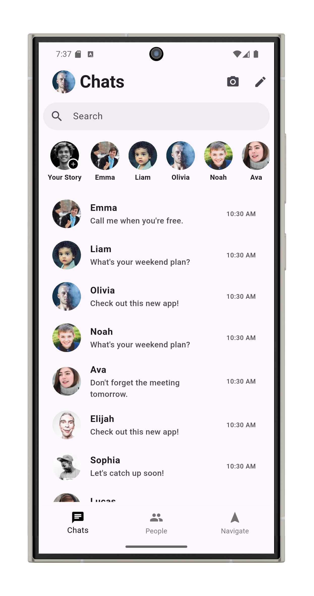
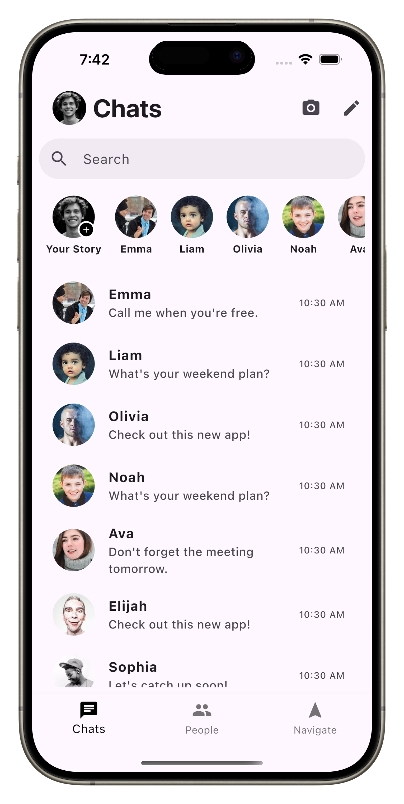

# Messenger-App-Ui

# 📱 Messenger UI Clone (Home Screen) - Flutter

This is a simple UI clone of the **Messenger Home Screen**, built using **Flutter**. The goal of this project was to practice Flutter layout widgets and mimic the sleek design of a modern chat app interface.

## ✨ Features

- Messenger-style home screen layout
- Avatar display for stories
- Recent chats list with profile, name, message preview, and time
- Responsive and clean UI design

> ⚠️ This project is UI-only — no backend or navigation is implemented.

## 📁 Project Structure

```
lib/
├── main.dart       # Entry point of the app
└── home.dart       # Contains the UI for the Messenger home screen
```

## 📸 Screenshots

### Android UI



### iOS UI



> To take a good screenshot:
> - Run the app on an emulator or real device
> - Press `Shift + S` in Android Studio or use native screenshot tools
> - Make sure the entire phone screen is visible
> - Use a clean or gradient background (you can edit it using tools like [MockUPhone](https://mockuphone.com/) or [Smartmockups](https://smartmockups.com/)) for a polished look

## 🚀 Getting Started

To run this project locally:

```bash
git clone https://github.com/sahilmishra03/Messenger-App-Ui
cd messenger-ui-clone
flutter pub get
flutter run
```

Make sure you have Flutter installed. You can check [Flutter's official docs](https://flutter.dev/docs/get-started/install) if you're new.

## 🛠️ Built With

- [Flutter](https://flutter.dev) — UI toolkit by Google for natively compiled apps

## 📚 Learning Outcomes

- Practiced Flutter layout widgets like `Row`, `Column`, `ListView`, `CircleAvatar`, and more
- Understood how to structure basic Flutter apps using separate Dart files
- Gained experience replicating real-world UI from popular apps

## 🙌 Acknowledgments

Inspired by the Facebook Messenger UI design.

---

Feel free to fork, customize, or build upon this project!